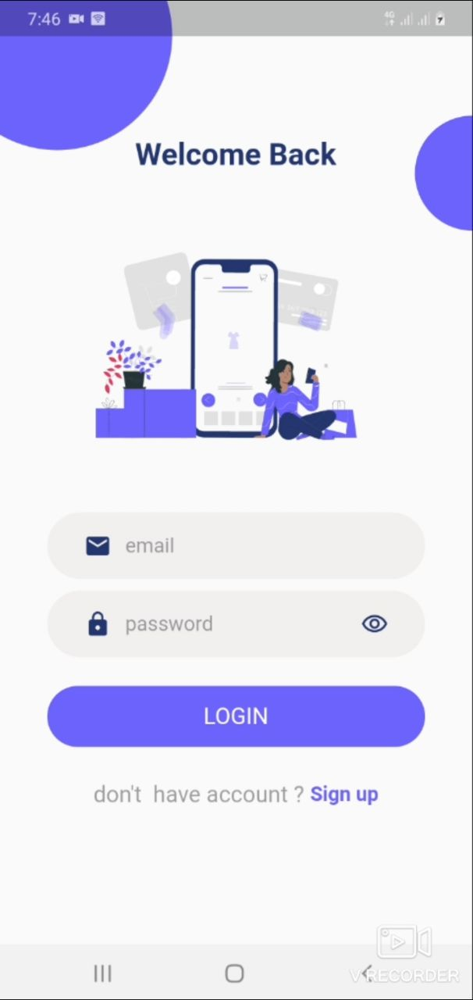
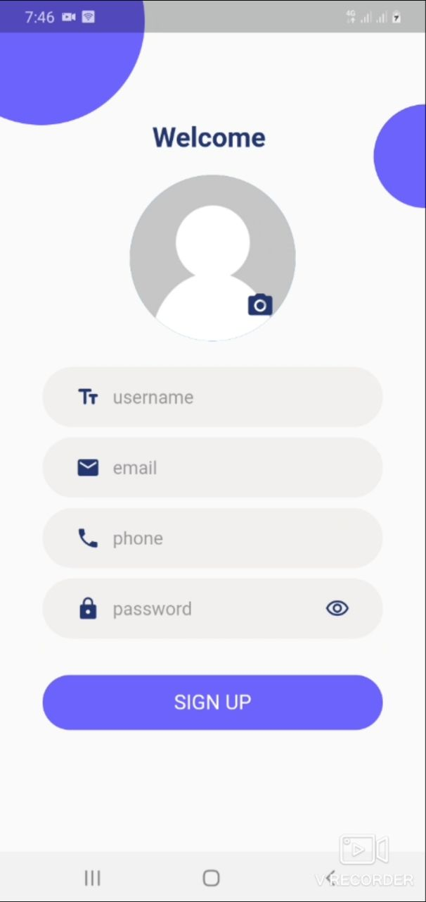
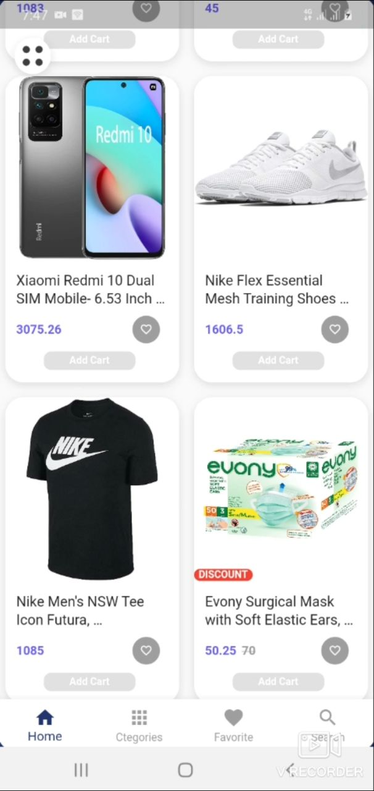
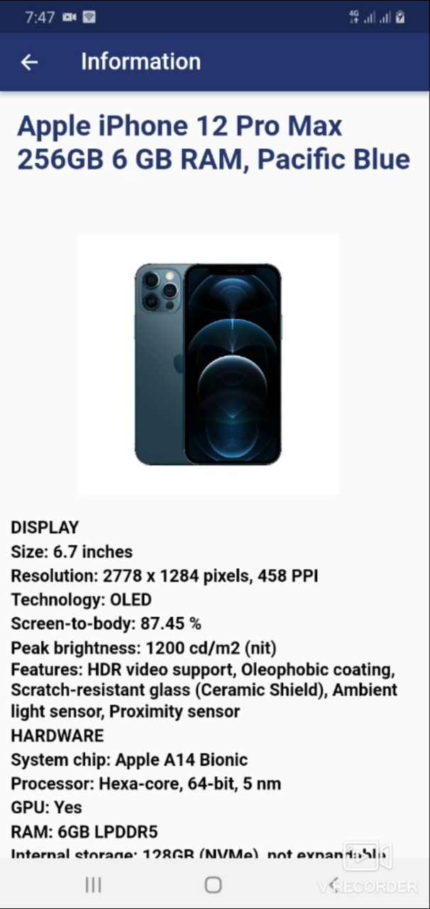
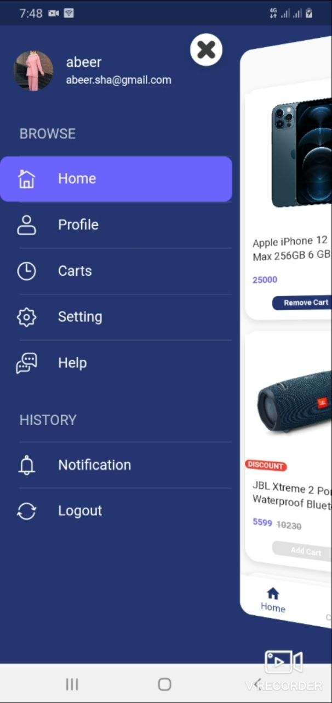
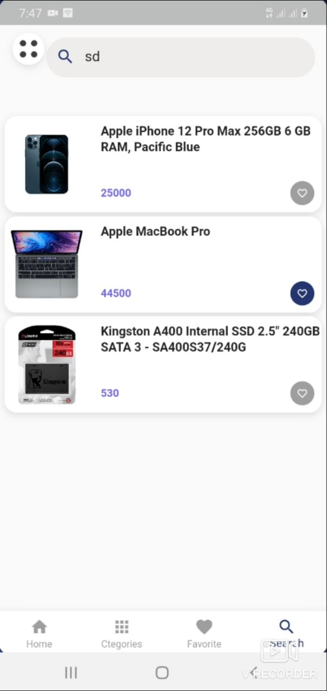

# shopping

Shopping is a mobile application for displaying and browsing products, providing users with a simple and intuitive interface to explore available items.

## Screenshots









## Getting Started

This project is built with Flutter. To run it:

```bash
flutter pub get
flutter run
